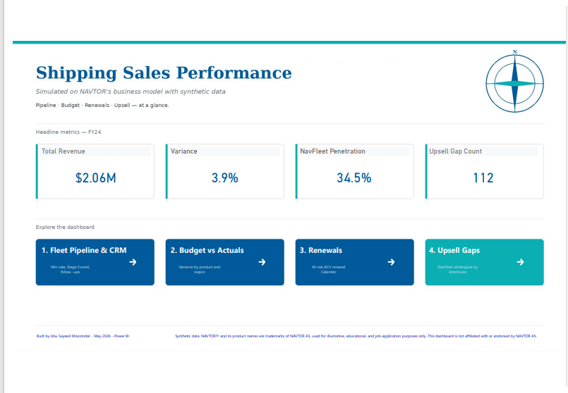
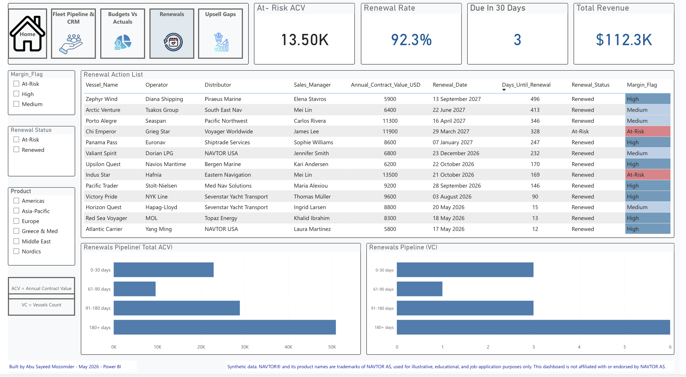

# Shipping Sales Performance Dashboard

A four-view sales intelligence dashboard built in **Power BI**, simulating NAVTOR's business model on **synthetic data**. Built as a portfolio piece to demonstrate the kind of analytics a Sales Coordinator would own day-to-day.

## Headline finding

**~$560K–$900K of upsell opportunity** sits in the existing customer base. 112 vessels currently use NavStation but have not been moved up to NavFleet — more than a quarter of total annual revenue, available without a single new logo acquisition.

## Live dashboard

**[Open the interactive dashboard →](https://app.powerbi.com/view?r=eyJrIjoiMjkyNTRkMjgtZjBiOC00Y2EyLWI4OTQtZDEwOWE0MmYwYmQzIiwidCI6ImM2ZTU0OWIzLTVmNDUtNDAzMi1hYWU5LWQ0MjQ0ZGM1YjJjNCJ9&pageName=01d8daf0b875d539c486)**

Hosted via Power BI Service.

---

## The four views

### 1 · Pipeline & CRM

Pipeline health, stage funnel, top-priority follow-ups, revenue distribution by region.

- **Headline win rate: 22.5%** — but this includes in-flight deals in the denominator.
- **Funnel attrition is balanced** — Demo, Proposal, and Negotiation each shed roughly a quarter. No single broken stage.
- **Concentration risk is low.** Europe leads at $0.47M; the next four regions sit between $0.33M- $0.31M.
- **Nordics underperforms at $0.13M** — striking because Nordics is NAVTOR's home market.

### 2 · Budget vs Actuals

Actual revenue vs plan by product, region, and month.

- **$1.66M actual vs $1.60M plan — $0.06M above budget YTD.**
- **PAYS shows the most monthly volatility** in the heatmap, as expected for a usage-based product. Subscription products like NavStation are smoother.
- **Japan and Americas are 11–14% above plan; Nordics is 8% below.** The pattern reflects market-mix (strong year for container/tanker, soft year for Nordic offshore) — not sales execution. The corrective action is rebalancing budget allocation by segment, not pushing Nordic AEs harder.

### 3 · Renewals

Renewal calendar, at-risk ACV, churn flagging.

- **$25.4K of margin-at-risk ACV** — Flat-Fee contracts with thin margin renewing within the year. Standard practice is to renegotiate up before auto-renewal or migrate to PAYS where revenue scales with usage.
- **Renewal rate at 2.2% is a calculation artifact** — most contracts haven't reached their renewal date yet. The actionable number is **"Due in 30 Days" — 3 contracts** that drive next week's customer-success conversations.

### 4 · Upsell Gaps

NavFleet whitespace analysis by distributor and region.

- **112 vessels currently use NavStation but not NavFleet** — the central finding of the dashboard.
- **At a typical NavFleet ACV of $5,000–$8,000 per vessel, that's $560K–$900K of addressable upsell** sitting in the existing customer base.
- **Penetration matrix** surfaces where the gap is concentrated by region.
- **Distributor performance table** identifies which distributors are over-delivering and which need support — a weekly briefing report for regional AEs.

---

## Tech stack

- **Power BI Desktop** — data modeling, DAX, page layout
- **Power BI Service** — publish, embed, public link
- **Custom DAX model** — 17 measures across 200 vessels and 7 regions
- **Python (Pillow)** — generated the cover-page background image
- **Custom theme JSON** — navy/teal palette tuned for maritime industry context

Key DAX measures documented in [`docs/measures.md`](docs/measures.md).

---

## About the data

All data is **synthetic** — generated to plausibly resemble a maritime SaaS product mix, regional distribution, and contract economics, but no real customer, deal, or revenue figure appears anywhere in this repository.

The `.pbix` source file is not included in this public repository. Available on request.

---

## Disclaimer

NAVTOR® and its product names (NavStation, NavFleet, PAYS, NavBox, Digital Logbook) are trademarks of NAVTOR AS, used illustratively in this portfolio piece for educational and job-application purposes. **This project is not affiliated with, sponsored by, or endorsed by NAVTOR AS.**

---

## Author

**Abu Sayeed Mozomder** · Built May 2026 · A Portfolio for Sales Coordinator role.
